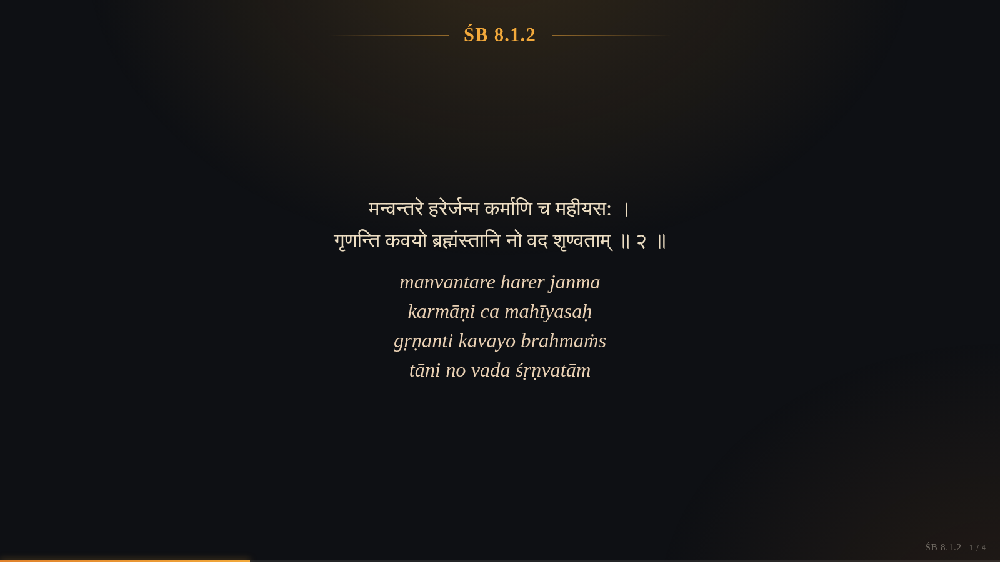
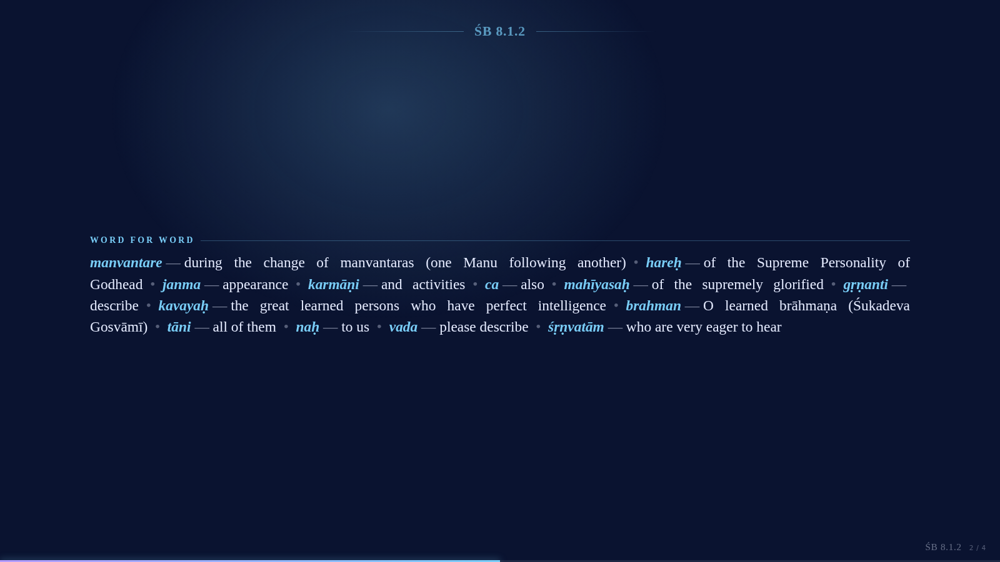
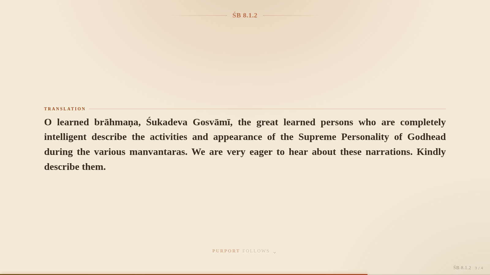
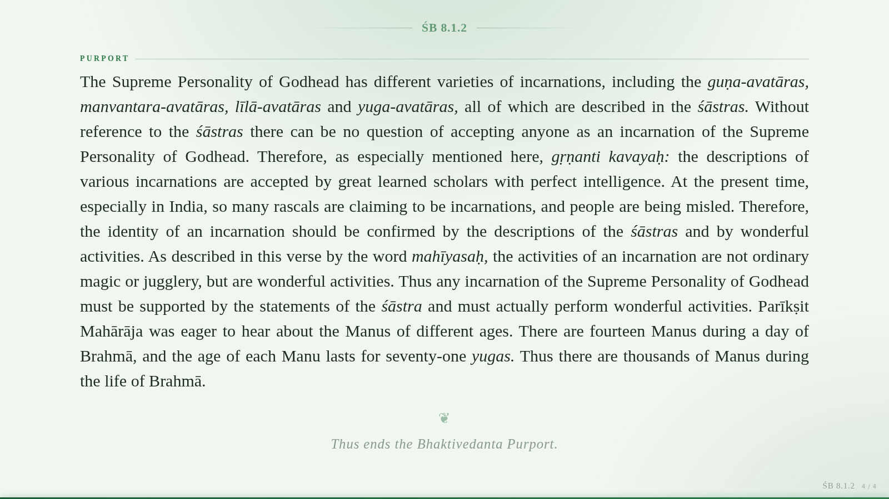

# Śloka Slides — Verse Presenter

> A Chrome extension that turns scripture pages — verse number, Devanāgarī / Bengali,
> transliteration, word-for-word meanings, translation and purport — into a clean,
> distraction-free slideshow for classes and temple programs.


<p align="center">
  
</p>

Open a verse page (e.g. Vedabase.io), click the icon, and present. The page clutter
disappears and you get large, readable slides you can drive from the keyboard, a
presentation clicker, or a touch screen — with light/dark themes, full typography
control, search, auto-advance, and one-click **PDF export**.

---

## Contents
- [Features](#features)
- [Install](#install-1-minute)
- [Everyday use](#everyday-use)
- [In the slideshow](#in-the-slideshow)
- [How slides are filled](#how-slides-are-filled)
- [Site mappings](#site-mappings)
- [Export & backup](#export--backup)
- [Gallery](#gallery)
- [Project layout](#project-layout)
- [Development](#development)
- [Privacy & permissions](#privacy--permissions)
- [License](#license)

---

## Features

- **Clean presentation** of verse, transliteration, word-for-word, translation and purport — nothing else.
- **Works on any site** — a built-in Vedabase.io mapping, smart heuristic detection for other sites, and a point-and-click **Map this site** tool for anything unusual.
- **Multi-verse & multi-page** — present a single verse, selected verses from a chapter page, a whole chapter, verses collected across many pages, or pasted text.
- **One section per slide** (default) or **fit as much as fits** — with sentence-aware pagination that never leaves orphan words dangling on a slide.
- **"Purport follows"** faded cue after a translation, and a recited **"Thus ends the Bhaktivedanta Purport"** closing line glued to the final purport.
- **10 themes** (5 light, 5 dark) plus a custom colour picker, four ambient backgrounds, and full typography control (fonts, size, line/letter/word spacing, per-section scaling).
- **Presenter tools** — search & highlight, jump-to-verse, auto-advance (fixed time or reading pace), black/white screen, laser pointer, spotlight, click-to-highlight words.
- **Editable verse numbers** — click ✎ on a heading (or press `E`) to correct a verse number in place; handy when a page shows "Text 1, Text 2".
- **Per-section text size, remembered** — `+` / `−` resize only the section shown on the current slide (verse, word-for-word, translation or purport) and the size is saved automatically, so every future verse uses it; `Alt`+`+` / `Alt`+`−` resize everything.
- **Header control** — show the top verse-number header on verse slides only (default), on all slides, or turn it off; the bottom corner reference stays.
- **Export the whole slideshow as a PDF** — one slide per page, colours preserved, no external libraries.
- **Keyboard, clicker & touch** navigation, progress bar with verse ticks, faded corner reference.
- **Everything is local** — no accounts, no servers, no tracking. Settings and mappings can be exported and shared.

## Install (1 minute)

1. Download the latest [`sloka-slides.zip`](../../releases) (or clone this repo).
2. Unzip it. You should see `manifest.json` at the top level of the folder.
3. Open `chrome://extensions` and switch on **Developer mode** (top-right).
4. Click **Load unpacked** and choose the extension folder (the one containing `manifest.json`).
5. Pin the orange lotus icon to your toolbar.

> Works in any Chromium browser — Chrome, Edge, Brave, Vivaldi.

## Everyday use

| What you want | How |
|---|---|
| Present one verse page | Click the icon → **Present this page** (or `Alt+Shift+S`) |
| Present only some verses of a chapter page | Select them with the mouse → **Present selection** |
| Verses spread over many pages | On each page **Add to collection** (`Alt+Shift+A`) → **Present collection** |
| A whole chapter from its contents page | Select the links → **Present linked pages** |
| Any copied text | **Paste text** |
| A site the extension doesn't understand | **Map this site** → click *Pick* and point at each part |

The right-click menu offers the same actions.

## In the slideshow

| Key | Action |
|---|---|
| `→` `Space` `PgDn` | Next slide |
| `←` `PgUp` `Backspace` | Previous slide |
| `↓` / `↑` | Next / previous verse |
| `Home` / `End` | First / last slide |
| `G` or `/` | Verse list & search |
| `J` | Jump to a verse number |
| `E` | Rename this verse's number (Enter saves, Esc cancels) |
| `T` | Quick tools (theme, font, size, spacing, layout…) |
| `+` `−` `0` | Size of the **section on this slide** — saved for every verse / reset it |
| `Alt`+`+` `−` `0` | Overall text size for **everything** / reset |
| `D` | Light / dark |
| `F` | Full screen |
| `A` | Auto-advance on / off |
| `Ctrl`/`⌘`+`P` | **Export the slideshow as a PDF** |
| `B` / `W` | Black / white screen |
| `L` | Laser pointer |
| `S` | Spotlight the paragraph under the mouse |
| `H` | Highlighter — click words to mark them |
| `1`–`5` | Toggle Devanāgarī, transliteration, word-for-word, translation, purport |
| `?` | Full shortcut list |

Presentation clickers work (they send PgUp / PgDn). Swipe on touch screens. The thin bar
along the bottom shows progress — hover it to preview verses, click to jump; ticks mark
where each verse starts. The current verse is shown faded in the bottom-right corner.

## How slides are filled

- **One section per slide** (default) — Verse · Word-for-word · Translation · Purport each start on a fresh slide. When a section runs over several slides, its heading shows the part count from the very first slide (e.g. "Purport 1 of 3").
- **Fit as much as fits** — flows onto the next slide only when the screen is full; short verses without a purport can be combined onto one slide.
- **Tidy breaks** — the purport is split at sentence boundaries. A whole sentence may move to the next slide, but a sentence is never broken to leave a few dangling words behind; when a single sentence is genuinely too tall, its word-split is balanced so no slide ends on a lonely sliver.
- **Purport cue** — when a translation ends and its purport is on the next slide, a faded *"Purport follows"* hint appears at the foot of the slide.
- **Closing line** — a recited *"Thus ends the Bhaktivedanta Purport."* is appended to the very last purport and stays glued to it, never on a slide of its own. (Both the cue and the closing line are optional and the closing text is editable.)

Everything re-flows instantly when you change the font, size or spacing — keeping your place.

## Site mappings

Vedabase.io has a built-in (best-effort) mapping. Any other site works through:

1. **Smart text detection** — headings like *Synonyms / Translation / Purport* and verse numbers like *ŚB 8.1.2* or *Text 2*, plus detection of Indic script; or
2. **A mapping you create** with **Map this site** — open a verse page, click *Pick* for each part, and point at the box on the page. Mappings support single-verse pages and full-chapter pages, with optional wildcard path patterns.

Mappings can be edited, enabled/disabled, exported and shared from **Settings → Site mappings**.

## Export & backup

- **PDF** — *Quick tools → Export as PDF*, the print icon in the toolbar, or `Ctrl`/`⌘`+`P`. Each slide becomes one page at the exact on-screen size, so nothing clips; theme colours are preserved. Choose *Save as PDF* in the browser dialog.
- **Deck** — export/import the current slideshow as a `.json` file.
- **Settings & mappings** — export/import everything from *Settings → Backup* or the quick-tools drawer, to move between computers or share with other teachers.

## Gallery

| Word-for-word (Yamunā Blue) | Translation with purport cue |
|---|---|
|  |  |

| Purport with closing line (Tulasī) |
|---|
|  |

## Project layout

```
manifest.json          Manifest V3 configuration
src/
  common.js            shared parsing, themes, fonts, settings, storage
  content.js           page extraction + interactive site mapper (injected on demand)
  background.js        commands, context menus, collection & deck storage
slides/                the slideshow — HTML, CSS, and the pagination/presentation engine
options/               the settings page (with a live preview)
popup/                 the toolbar popup
icons/                 extension icons
docs/screenshots/      images used in this README
```

## Development

There is **no build step and no runtime dependencies** — it is plain HTML, CSS and
vanilla JavaScript. To work on it:

1. `git clone` this repository.
2. Load the folder as an unpacked extension (see [Install](#install-1-minute)).
3. Edit files and click **Reload** on the extension card in `chrome://extensions`.

The slideshow (`slides/slides.html`) also runs standalone from a local web server for quick
iteration — it falls back to `localStorage` when the Chrome APIs are absent and shows a
built-in sample verse:

```bash
python3 -m http.server 8000
# then open http://localhost:8000/slides/slides.html
```

`window.__vs` is exposed on the slideshow page (`{ st, show, repaginate, exportPDF }`) for
inspection and scripted testing.

## Privacy & permissions

- **`activeTab` + `scripting`** — read the current page **only when you click** the extension.
- **`storage`** — save your settings, site mappings and recent slideshows locally.
- **`contextMenus`** — the right-click actions.

No page content ever leaves your browser. Fonts load from Google Fonts when online and fall
back to system fonts offline; no other network requests are made.

## License

[MIT](LICENSE) — free to use, modify and share.

Verse text, translations and purports belong to their respective publishers; this tool only
reformats pages you already have access to, for study and teaching.
